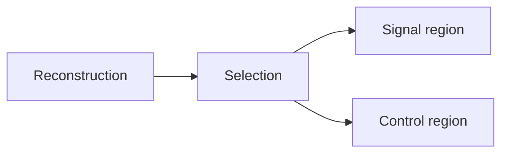

+++
title = "Reference"
weight = 60
+++

Use this page for compact pointers while keeping the lesson repository thin.

## Start with shared docs

- Shared module docs: [hugo-styles](https://oer-particle-physics.github.io/hugo-styles/)
- Authoring model: [Authoring Guide](https://oer-particle-physics.github.io/hugo-styles/docs/authoring/)
- Curated advanced features: [Hextra Features for Physics Lessons](https://oer-particle-physics.github.io/hugo-styles/docs/hextra-features/)
- Updates and release workflow: [Updating Downstream Lessons](https://oer-particle-physics.github.io/hugo-styles/docs/updates/)

## Why `_vendor/` exists

This template commits `_vendor/` so lesson authors can run `hugo server` without Go installed.
The vendored tree contains the shared `hugo-styles` module and its theme dependency at pinned versions from `go.mod`.

## Refresh `_vendor/`

### Using GitHub Actions (no local Go required)

In this repository, run the **Refresh vendored Hugo modules** workflow from the Actions tab.
It refreshes `go.mod`, `go.sum`, and `_vendor/`, then opens a pull request if anything changed.

### Locally (with Go installed)

```bash
hugo mod tidy
hugo mod vendor
hugo --gc --minify
```

Commit `go.mod`, `go.sum`, and `_vendor/` together.

## Small copy-paste examples

### LaTeX notation

```markdown
Inline: \(p_T > 25\,\mathrm{GeV}\)

$$
N_{\text{sig}} = N_{\text{obs}} - N_{\text{bkg}}
$$
```

### Mermaid flow

````markdown

````

### Shell tabs

~~~text


```bash
hugo server
```


```zsh
hugo server
```


~~~

Keep this page short. Put detailed feature walkthroughs in `hugo-styles` so downstream lesson repositories do not carry framework documentation.
